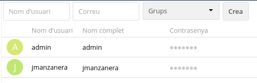

#  **CONFIGURACIÓ OWNCLOUD**

1. El primer que farem es crear un usuari, per això, ara mostrarem com la seva creació.

  **1.1** Accedim a la pestanya "Usuaris"

  

  **1.2** Dins de la pestanya, veurem els usuaris que tenim creats.

  

  En la part superior posa `Nom d'usuari` (pose el nom que vulguis pel teu usuari), `Correu` (El correu que utilitzes pe aquest usuari) y `Grups` (a quin grup vols que estigui l'usuari).

  **1.3** Una vegada ja tot configurat, li donem a `Crea`.

  

2. 
