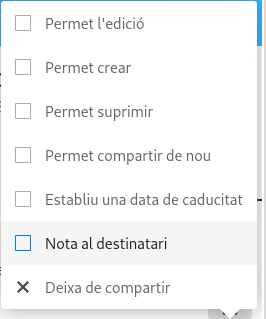

# **CONFIGURACIÓ DE NEXTCLOUD**

1. El primer que configurarem són els `Usuaris`.

  **1.1** En el cas dels Usuaris, es tan sencill com anar al nostre usuari (en el meu cas `jmanzanera`), i anar a l'apartat `Usuaris`.

  

  **1.2** Una vegada dins de Usuaris, veurem tots els `usuaris i grups` creats.

  

  **1.3** A la part esquerre, podrem veure una opció que posa `+ Nou Usuari`.

  

  **1.4** Si donem clic sobre aquesta opció, ens mostrarà els següents apartats:

  

  **1.5** Si ho hem fet tot correctament, podrem veure el nou usuari junt amb els altres ja creats.

  

2. Ara veurem un cas similar però amb els `Grups`.

  **2.1** On està la opció `+ Nou Usuari`, podem veure més abaix la opció `+ Afegeix un Grup`.

  

  **2.2** Si donem clic,tindrem que posar que nom volem pel nostre grup.

    

  **2.3** Una vegada creat, ho veurem en la llista de `Grups` (a l'esquerra).

  

3. Ara veurem com `crear Carpetes i Compartir-les` als `Usuaris/Grups`.

  **3.1** Ens anem a l'apartat `Fitxers`.

  

  **3.2** Podrem veure totes les `Carpetes` que tenim en el compte.

  

  **3.3** A dalt podrem veure un símbol `+` i podrem veure una serie d'opcions.

  

  **3.4** Si fem clic en l'opció `Crea una carpeta`, tindrem que posar un nom a la carpeta.

  

  **3.5** So ho hem fet correctament, tindrà que estar   junt les altres carpetes.

  

- Ara com Compartir carpetes:

  **3.6** Si fem clic en els 3 punts que té a carpeta, ens sortiran les opcions següents:

  

  **3.7** Si anem on posa `Compartint`, podrem veure amb qui està compartit la carpeta.

  Tindrem que utilitzar el buscador per posar el nom de l'usuari amb el que vulguem compartir la carpeta (en aquest cas amb `ete sech`)

  

4. I per últim, veurem com `configurar els Permisos d'un Usuari`.

  **4.1** En l'usuari amb el que hem compartit la carpeta, polsarem els 3 punts del costat.

  

  **4.2** Si li donem clic, veurem els permisos que té l'usuari sobre la carpeta.

  **Amb permisos**

  

  **Sense permisos**

  
