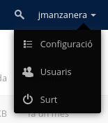
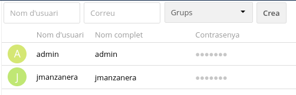
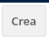

#  **CONFIGURACIÓ OWNCLOUD**

1. El primer que farem es crear un usuari, per això, ara mostrarem com la seva creació.

  **1.1** Accedim a la pestanya "Usuaris"

  

  **1.2** Dins de la pestanya, veurem els usuaris que tenim creats.

  

  En la part superior posa `Nom d'usuari` (pose el nom que vulguis pel teu usuari), `Correu` (El correu que utilitzes pe aquest usuari) i `Grups` (a quin grup vols que estigui l'usuari).

  **1.3** Una vegada ja tot configurat, li donem a `Crea`.

  

2. Si també volem crear un `grup` per posar dins als `usuaris`, tenim que fer el següent:

  **2.1** On hem creat els usuaris,al costat posa "`Grups`".

  

  Si fem click, veurem que n'hi ha els grups predeterminats, i si voem crear un grup nou.

  **2.2** On posa "`+ afegeix grup`", tindrem que fer click i posar un nom pel grup.

  

  Una vegada fet,podem veure que el grup esta creat correctament si es veu a la llista de `Grups`.

  3. Una altra cosa interessant que podem fer és `Compartir Carpetes`. Per compartir carpetes és força simple:

    **3.1** Ens dirigim a la Carpeta que volem Compartir (en aquest cas la carpeta `Documents`).

  

    **3.2** Una vegada localitzada la carpeta, busquem els 3 punts que estan a la dreta de la carpeta i veurem una pestanya on posa `Detalls`.

    Una vegada dins, tindrem que buscar la pestanya que podem veure a la imatge:

    

    **3.3** Anem a la part `Users and Groups`.

    

    **3.4** En el petit buscador que n'hi ha, busca l'usuari amb el que vols compartir la carpeta.

    Una vegada trobat, li dones click i veuras que ja la tens compartida amb aquell usuari.

    

  4. Ara veurem com gestionar els nostres arxius a OwnCloud.

    **4.1** Primer de tot, ens anem al menú principal de l'OwnCloud i, donem click a les 3 barres del menú.

    

    **4.2** Aquí podrem crear carpetes, arxius,.... si donem al símbol +.

    

    

    **4.3** Per saber que ha funcionat correctament, observem que estigui amb la resta.

    

5. També podem assignar `Permisos i Rols` als usuaris.

  **5.1** Pels permisos, podem anar a la `Carpeta Compartida` de l'apartat anterior i, allà podem treure els permisos que vulguem.

  **Amb permisos**

  

  **Sense permisos**

  

  **5.2** També podem posar una `data límit` per si volem que un usuari tingui permisos fins X data.

  

6. I per últim, amb els `Rols tot depèn del grup on estigui l'usuari`. Per exemple, l'usuari `jmanzanera` està al grup `Administradors`, doncs, té el rol de Administrador del compte de OwnCloud.
